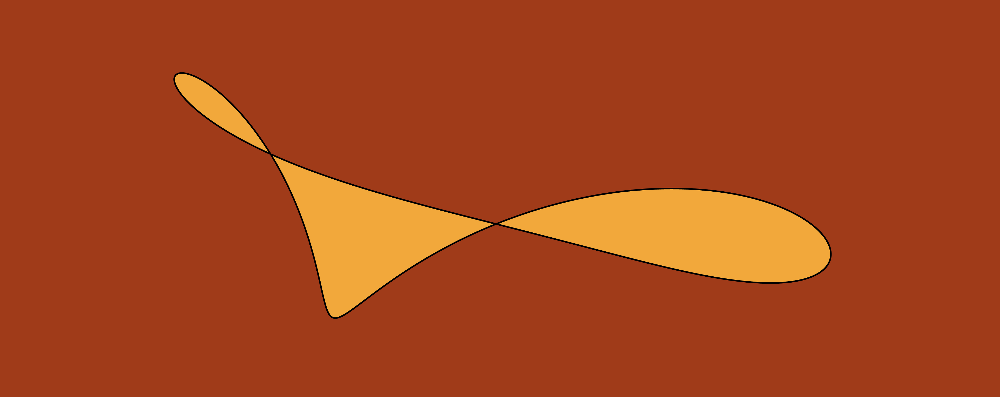
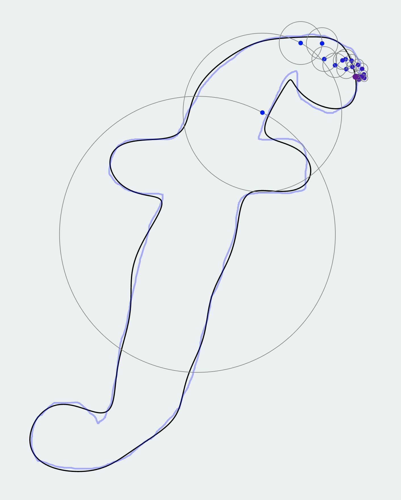
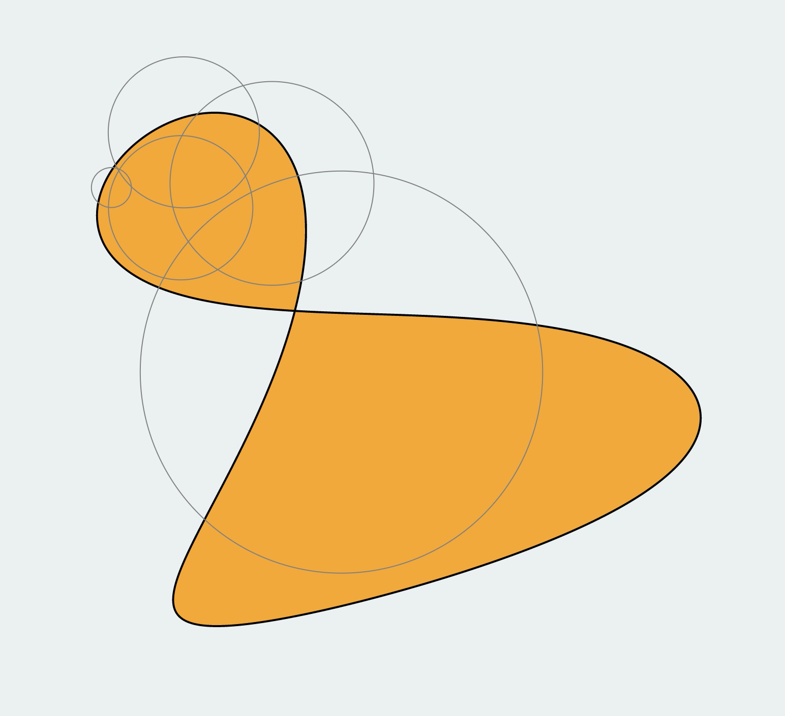

# Fourierizer

A single-page application written in TypeScript to demonstrate the fact that complex functions can be approximated by the sum of sines and cosines of integer frequencies.

It lets you draw any closed shape and then animates the corresponding [complex fourier series](https://en.wikipedia.org/wiki/Discrete_Fourier_transform) as the vector sum of rotating circles.

[Live version](https://fourier.retolucamerz.com)

## Screenshots

|                                         |                                         |
| :-------------------------------------: | :-------------------------------------: |
|  |  |

---

## Available Scripts

This project was bootstrapped with [Create React App](https://github.com/facebook/create-react-app).

In the project directory, you can run (once you installed all dependencies):

### `yarn start`

Runs the app in the development mode. 
Open [http://localhost:3000](http://localhost:3000) to view it in the browser.

The page will reload if you make edits. 
You will also see any lint errors in the console.

### `yarn build`

Builds the app for production to the `build` folder. 
It correctly bundles React in production mode and optimizes the build for the best performance.

The build is minified and the filenames include the hashes. 
Your app is ready to be deployed!

See the section about [deployment](https://facebook.github.io/create-react-app/docs/deployment) for more information.
